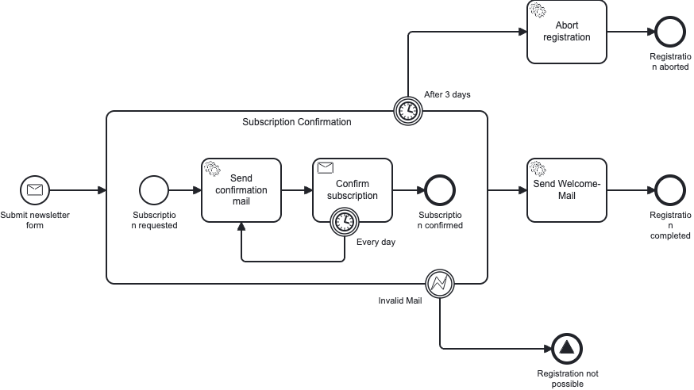

# 🦁 Engine Safari

Welcome to **Engine Safari** –
my playground and exploration of embedded BPMN workflow engines 🌍

## 🧭 Why This Exists

Camunda 7 is reaching **end of life**.
If you're running it, migration planning isn't optional anymore – it's survival.

In this repository I explore alternatives in the embedded engine landscape.
Where can you go if you need to migrate?
What are your options if you want to stick with embedded orchestration
rather than moving to remote/cloud-based solutions?

While **Camunda 8 (Zeebe)** is the cloud-native, remote successor
(explored in our sister repo [easy-zeebe](https://github.com/marcoag/easy-zeebe)),
this safari focuses on **embedded alternatives** –
engines that run inside your domain-application.

## 🗺️ The Specimens

Each engine has its own module with a complete Spring Boot implementation.
All modules implement the same **newsletter subscription process** –
simple, but demonstrates the full workflow lifecycle.

The model exercises message start events, a sub-process with an inner receive task,
a non-interrupting reminder timer, an interrupting abort timer, and a boundary error.
Each module ships a process-test suite (`NewsletterSubscriptionProcessTest`) that
walks all four variants — happy path, abort after 3 days, invalid mail error,
reminder resend — using the engine's official `bpm-assert` library.

- **🏛️ [Camunda 7](service/camunda-7)** – The classic implementation using traditional JavaDelegate pattern
- **🏛️ [Camunda 7 with Process-Engine-API](service/camunda-7-with-process-engine-api)** – Camunda 7 with engine-neutral abstraction layer
- **🌿 [CIB-Seven](service/cib-seven)** – Fork maintained by [CIB Software GmbH](https://cibseven.org/)
- **🔧 [Operaton](service/operaton)** – Community-driven fork by [Operaton](https://operaton.org/)

### Remote Engines

For **Zeebe** ([Camunda 8](https://camunda.com/de/platform/zeebe/)),
check out [easy-zeebe](https://github.com/emaarco/easy-zeebe)

## 📂 Repository Structure

- **`/src`**: Engine integrations and working code
- **`/stack`**: Docker Compose files for databases and infrastructure
- **`/bruno`**: API requests using [Bruno](https://www.usebruno.com/)
- **`/run`**: IntelliJ run configurations

---

**🦁 Happy exploring! May your migrations be smooth and your processes orchestrate beautifully.** ✨
