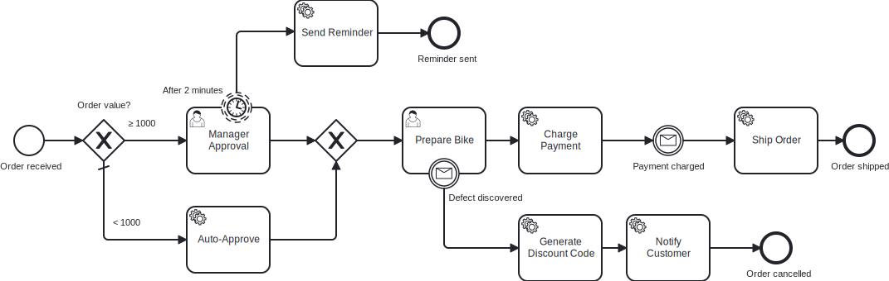

# 🌿🛰️ CIB-Seven Remote Example

A **remote** operation example for **CIB7**: the engine only *hosts and deploys* the
process, while all service-task logic runs in **this separate, stateless service** and is
consumed as **external tasks** over the engine's REST API.

This is the counterpart to the embedded [`cib-seven`](../cib-seven) specimen: same engine,
opposite topology.

## How it works

- The **`bike-order` process** (`bikeOrderProcess`) is deployed by the embedded engine in
  [`service/cib-seven`](../cib-seven) (port **8081**). Its service tasks are configured as
  **external tasks** (`camunda:type="external"`) – the engine just parks them and waits.
- This service (port **8082**) uses the **CIB Seven External Task Client**
  (`cibseven-bpm-spring-boot-starter-external-task-client-4`) to fetch, lock and complete those
  external tasks remotely. Handlers subscribe via `@ExternalTaskSubscription`, using the topic
  constants generated by [bpmn-to-code](https://github.com/miragon/bpmn-to-code) in
  `BikeOrderProcessProcessApi`.
- It also **drives the process remotely** via a Spring `RestClient` against `/engine-rest`:
  starting instances and completing the **user tasks** (`Manager Approval`, `Prepare Bike`).
- Finally, it acts as a **process-out adapter**: after *Charge Payment*, the process parks at the
  **`Payment charged`** message catch event and waits for an *external* confirmation (think: a payment
  provider's async webhook). A Spring `@Scheduled` poller (`PaymentConfirmationScheduler`, every
  **10s**) correlates the `Message_PaymentCharged` message back into the engine over
  `POST /engine-rest/message` (`all: true`), delivering it to every waiting instance. This is the
  missing direction – *sending* a message **into** the engine, the counterpart to *consuming*
  external tasks.
- It also handles an **escalation**: an interrupting **`Defect discovered`** message boundary event
  on *Prepare Bike*. Reporting a defect (`POST /engine-rest/message`, correlated to that one order)
  cancels the preparation and diverts to *Generate Discount Code* → *Notify Customer* (mail with the
  code) → an end event that cancels the order.

### Service-task topics

Topics follow the `<service.name>.<task>` pattern (service name `bikeLeasing`):

| BPMN task | Topic |
|---|---|
| Auto-Approve | `bikeLeasing.autoApprove` |
| Send Reminder | `bikeLeasing.sendReminder` |
| Charge Payment | `bikeLeasing.chargePayment` |
| Ship Order | `bikeLeasing.shipOrder` |
| Generate Discount Code | `bikeLeasing.generateDiscountCode` |
| Notify Customer | `bikeLeasing.notifyCustomer` |

## Quick Start

1. Start PostgreSQL: `docker-compose -f stack/docker-compose.yml up -d`
2. Start the engine host [`service/cib-seven`](../cib-seven) (port 8081, deploys the model).
3. Start this service (port 8082) via the IntelliJ run configuration in `/run`.
4. Drive the process with the requests in `/bruno`:
   - `POST http://localhost:8082/api/bike-orders` `{ "orderTotal": 500 }` → returns `orderId`
     (the process-instance id). `orderTotal < 1000` takes the **auto-approve** path;
     `>= 1000` waits at **Manager Approval**.
   - `POST http://localhost:8082/api/bike-orders/{orderId}/approve` – completes Manager Approval.
   - `POST http://localhost:8082/api/bike-orders/{orderId}/prepare` – completes Prepare Bike.
   - `POST http://localhost:8082/api/bike-orders/{orderId}/report-defect` – *escalation*: while the
     order waits at **Prepare Bike**, reports a defect. The order is diverted to
     `generateDiscountCode` / `notifyCustomer` and then **cancelled** instead of being charged
     and shipped.
5. Watch the external-task workers auto-complete `autoApprove` / `chargePayment` in the logs. After
   *Charge Payment* the instance parks at **`Payment charged`** until the `PaymentConfirmationScheduler`
   correlates the message (within ~10s); then `shipOrder` runs and the instance ends. Inspect it in the
   CIB7 Cockpit at http://localhost:8081/camunda.

> The reminder boundary timer on *Manager Approval* is shortened to `PT2M` so the
> `bikeLeasing.sendReminder` worker fires within the demo. The `Payment charged` poll interval is
> configurable via `bike-order.payment-confirmation.poll-interval` (default `10000` ms).
